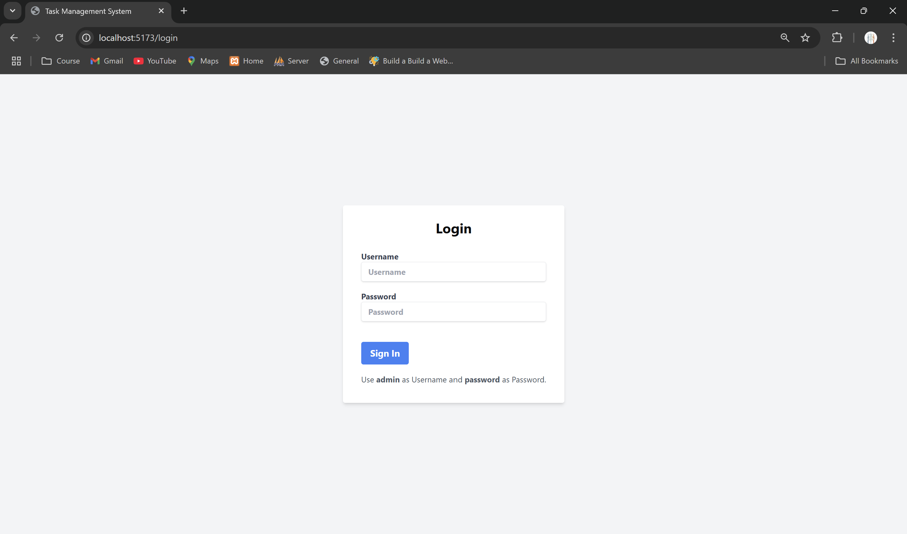
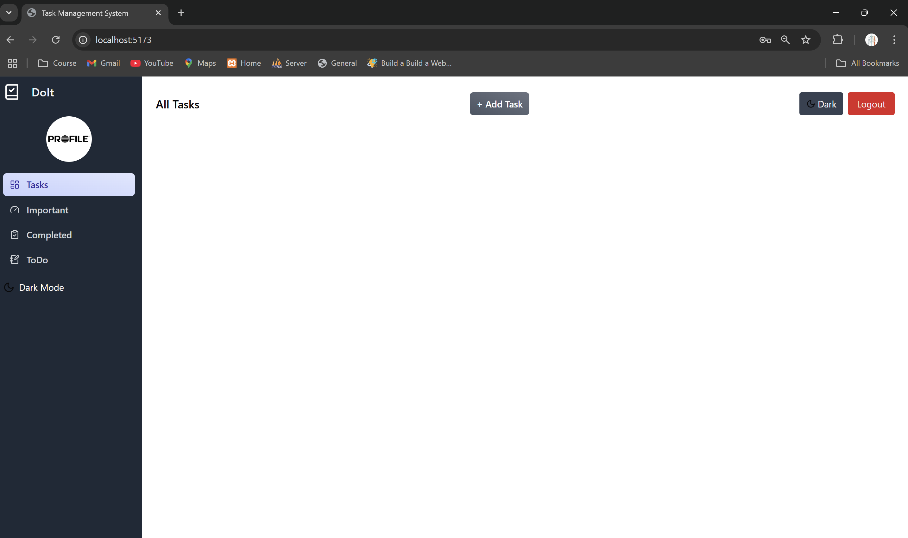
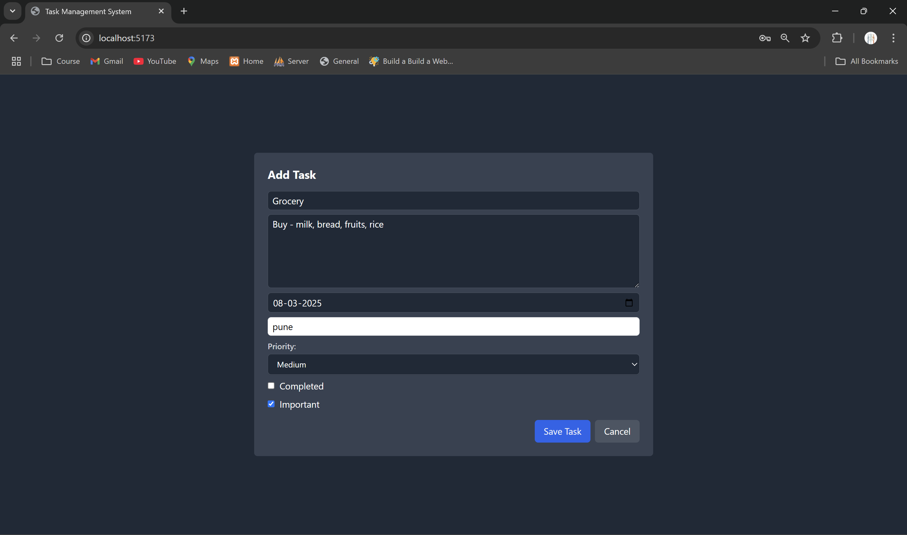
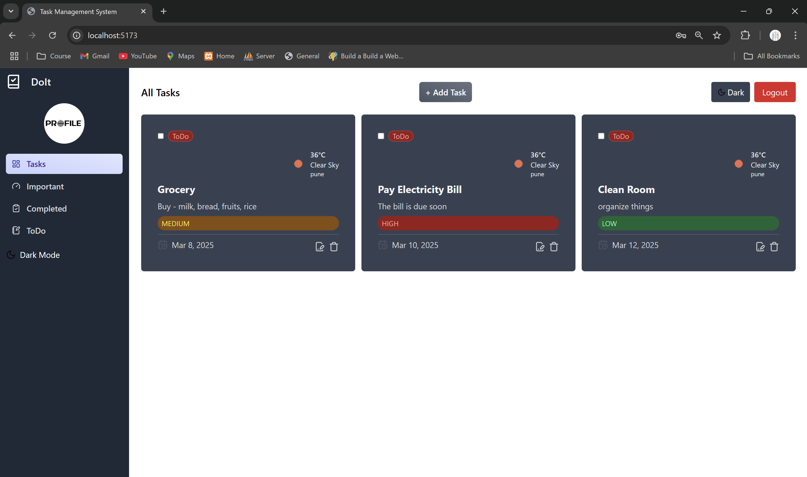
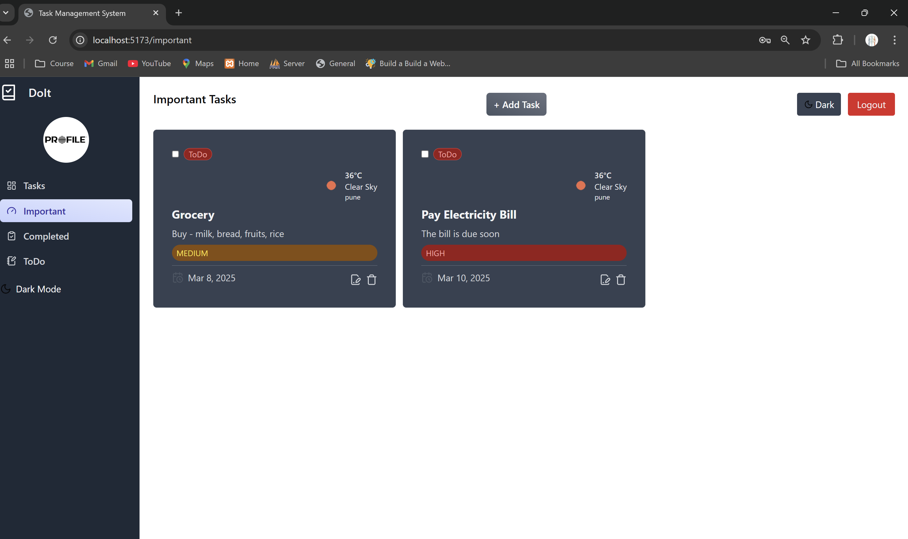
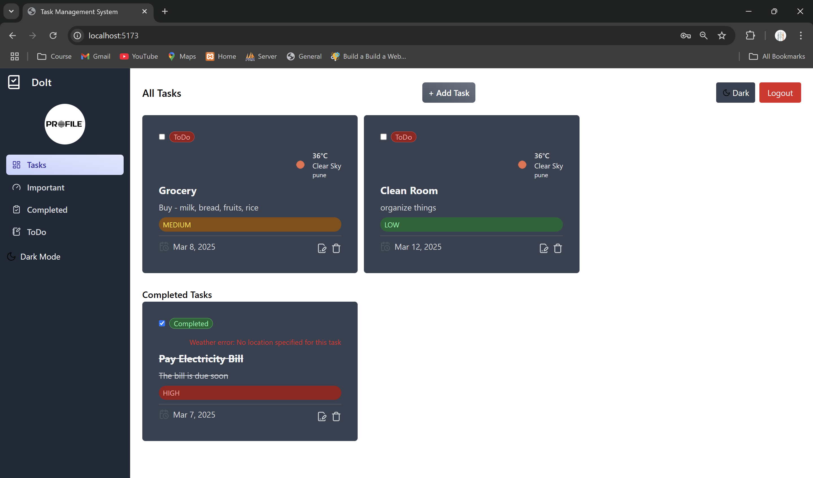

# React To-Do Application

This is a To-Do application built using ReactJS and Redux with Vite as the build tool. It allows users to add, view, update, and delete tasks while also providing options to mark tasks as completed, important, and set task priority. Additionally, it displays the weather for the selected location to help users plan tasks accordingly.

## Features

- Add New Tasks – Enter a title, set a deadline, mark tasks as completed or important, and assign a priority level.
- View Tasks – Display all tasks in a structured card format.
- Update tasks including modifying title, deadline, completion status, and importance.
- Delete tasks from the list.
- Filter tasks by completed, important, and to-do (not completed) statuses.
- Set Task Priority – Assign priority levels (Low, Medium, High) to better organize tasks.
- Weather Display – Shows the current weather for the selected location, helping users schedule tasks based on conditions.

## Technologies Used

- ReactJS: Frontend library for building user interfaces.
- Vite – Fast build tool for modern frontend development.
- Redux: State management library for managing application state.
- React Router: Declarative routing for React applications.
- Tailwind CSS: Utility-first CSS framework for styling the application.
- React Icons & Lucide React: Library providing popular icon packs as React components.
- Redux Toolkit: Toolkit for efficient Redux development including simplified store setup, action creation, and reducer logic.

## Getting Started

### Prerequisites
Ensure you have Node.js installed.

To run the application locally, follow these steps:

1. Clone this repository to your local machine.
   ```
   git clone https://github.com/Sandesh3011/QuadB-Assignment-todo-app.git

   ```
2. Navigate to the project directory.
3. Install dependencies using npm or yarn:
   ```
   npm install
   ```
4. Run the development server:
   ```
   npm run dev
   ```
5. Open your browser and navigate to http://localhost:5173 (Vite's default port).

## Usage

- Use the sidebar to navigate between different sections of the application.
- Add new tasks by filling out the form in the "ToDo" section and clicking the "Add Task" button.
- View all tasks in the "Tasks" section,
- Mark tasks as completed or important
- Edit task details, including priority level
- Delete tasks
- Filter tasks by completed, important, or to-do statuses using the sidebar links.
- Edit tasks by clicking the "Edit" button on each task card, making changes in the modal, and clicking "Save Changes."
- Delete tasks by clicking the "Delete" button on each task card.

## Deployment
This application is deployed using Vercel Pages & Vite as a build tool.

## Screenshots

### 1. Login Page


### 2. Task Dashboard


### 3. Add Task


### 4. Task List


### 5. Important Task 


### 6. Completed Tasks

